<!-- Banner -->
<div align="center">

<h1>🏦 LendSure AI/h1>
<h3><em>LendSure AI — ML-Powered Loan Approval Intelligence Platform</em></h3>

<p>
  
  
  
  
  
  
  
  
</p>

<p>
  <strong>End-to-end ML loan approval system</strong> with three trained classifiers, a full preprocessing pipeline, live risk scoring, and a polished Streamlit UI — deployed on Hugging Face Spaces.
</p>

</div>

---

## 📌 Problem Statement

Traditional loan approval processes rely heavily on manual assessment, prone to bias, inconsistency, and delays. Financial institutions need a transparent, data-driven system that evaluates loan eligibility based on applicant financial signals — without human subjectivity.

**CreditWise Loan System** addresses this by automating loan eligibility prediction using three scikit-learn classifiers trained on real applicant data, with a complete preprocessing pipeline and a production-grade Streamlit interface with live risk scoring and explainability.

---

## ✅ Solution Overview

A three-model ML system where each classifier is trained on the same deterministic pipeline:

```
Raw applicant data → Imputation → Encoding → Feature Engineering → Scaling → Classifier → Decision
```

The UI surfaces predictions with model confidence, a live risk scorecard, and actionable improvement tips — making the system interpretable to end users, not just data scientists.

---

## 🚀 Key Features

| Feature | Description |
|---|---|
| 🤖 **3 ML Models** | Logistic Regression (best overall), KNN, Naive Bayes (best precision) — switchable in UI |
| ⚡ **Live Risk Scorecard** | Real-time scoring of Credit Score, DTI, Income, Savings, Collateral as user inputs |
| 📊 **Model Comparison Dashboard** | Side-by-side accuracy, precision, F1 comparison of all three models |
| 🔧 **Feature Engineering** | Squared transformations for DTI Ratio and Credit Score for non-linear signal capture |
| 🎨 **Navy-Blue Branded UI** | Production-grade Streamlit UI with custom CSS, gradient header, pill badges |
| 💡 **Eligibility Tips** | Actionable suggestions for rejected applicants to improve their profile |
| 📈 **EDA Insights Page** | Credit band approval rates, dataset overview, key factor analysis |
| 📦 **Pickle Artifacts** | All preprocessing objects (scaler, encoder) and models serialized for exact reproduction |

---

## 🏗️ Overall Architecture

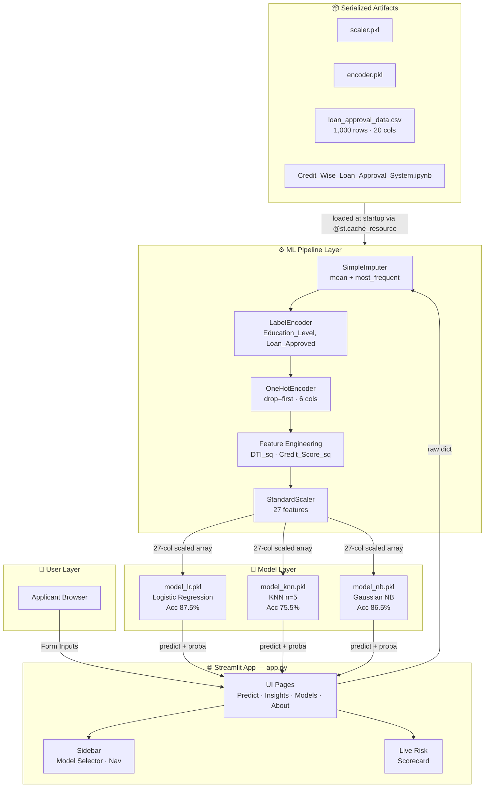

---

## 🧠 System Architecture

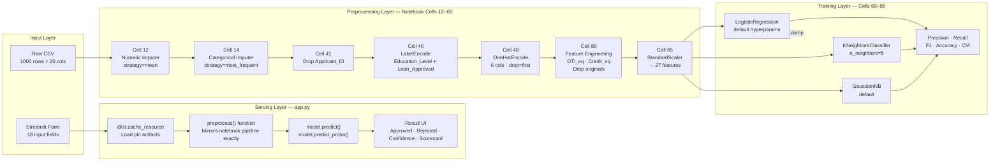

---

## 🧰 Technology Stack — Complete Breakdown

> Every library, framework, tool, and artifact used across all layers of the system.

### Core Stack

| Technology | Version | Category | Purpose in Project | Why Chosen | Key Features Used |
|---|---|---|---|---|---|
| **Python** | 3.10+ | Language | Entire ML pipeline and Streamlit app | Universal ML ecosystem, Streamlit compatibility | f-strings, pathlib, dataclasses |
| **Streamlit** | 1.x | UI Framework | Multi-page web app with sidebar nav, forms, metrics | Fastest way to deploy ML apps without frontend code | `st.cache_resource`, `st.columns`, `st.progress`, `st.dataframe`, custom CSS injection |
| **scikit-learn** | 1.x | ML Framework | All preprocessing and model training/inference | Industry standard, unified API across all classifiers | `SimpleImputer`, `LabelEncoder`, `OneHotEncoder`, `StandardScaler`, `LogisticRegression`, `KNeighborsClassifier`, `GaussianNB`, `train_test_split`, confusion_matrix, classification_report |
| **pandas** | 2.x | Data Manipulation | DataFrame operations, OHE column merging, CSV loading | Vectorized operations, seamless scikit-learn integration | `pd.read_csv`, `pd.concat`, `pd.DataFrame`, `df.drop`, `df.select_dtypes`, `df.reindex` |
| **NumPy** | 1.x | Numerical Computing | Array operations, squared feature computation | Foundation for all scikit-learn data structures | `np.ndarray`, `np.log1p` (explored), squared transforms |
| **matplotlib** | 3.x | Visualization | EDA plots in notebook (histograms, boxplots) | Standard Python plotting, seaborn backend | `plt.figure`, `plt.pie`, `plt.show` |
| **seaborn** | 0.x | Statistical Viz | Distribution and correlation analysis in notebook | High-level API on matplotlib, beautiful defaults | `sns.barplot`, `sns.histplot`, `sns.boxplot`, `sns.heatmap` |
| **pickle** | stdlib | Serialization | Serialize all trained models and preprocessing artifacts | Zero-dependency, built-in Python serialization | `pickle.dump`, `pickle.load` for 5 artifacts |
| **pathlib** | stdlib | File I/O | Cross-platform path handling for pkl file loading | More Pythonic than os.path, works on HF Spaces | `Path.exists()` for graceful missing-artifact handling |

### ML Artifacts (Serialized)

| Artifact | Type | Purpose | Fitted On |
|---|---|---|---|
| `model_lr.pkl` | `LogisticRegression()` | Primary classifier — best overall | `x_train_scaled` (800 rows × 27 cols) |
| `model_knn.pkl` | `KNeighborsClassifier(n_neighbors=5)` | Pattern-similarity classifier | `x_train_scaled` (800 rows × 27 cols) |
| `model_nb.pkl` | `GaussianNB()` | Best precision — minimizes false approvals | `x_train_scaled` (800 rows × 27 cols) |
| `scaler.pkl` | `StandardScaler` | Feature normalization (exact 27-col order) | `x_train` (27 features, post-engineering) |
| `encoder.pkl` | `OneHotEncoder(drop='first', sparse_output=False)` | Categorical encoding for 6 columns | Full categorical block pre-split |

### Dataset

| Property | Value |
|---|---|
| File | `loan_approval_data.csv` |
| Rows | 1,000 |
| Raw Features | 20 columns |
| Final Features | 27 (post-engineering + OHE expansion) |
| Target | `Loan_Approved` (binary: Yes/No) |
| Class Distribution | ~29.8% Approved / ~65.2% Rejected (imbalanced) |

---

## 🔄 Request Lifecycle

### Flow 1: Loan Eligibility Prediction

```
1. USER INTERACTION
   └── Applicant fills 18 input fields across 3 sections:
       → Applicant Profile (age, gender, marital, dep, edu, emp, employer)
       → Financial Details (income, co-income, savings, credit_score, dti, ex_loans)
       → Loan & Property (loan_amount, loan_term, purpose, collateral, property_area)
       → Clicks: "🔍 Predict Loan Eligibility"

2. STREAMLIT EVENT HANDLING
   └── predict_btn → True
       → Builds raw dict of 18 key-value pairs
       → Selects pkl path from MODEL_OPTIONS dict based on sidebar radio

3. ARTIFACT LOADING (cached)
   └── @st.cache_resource: load_scaler() → scaler.pkl
       @st.cache_resource: load_encoder() → encoder.pkl
       @st.cache_resource: load_model(sel_pkl) → model_lr/knn/nb.pkl
       → Cached after first load — zero reload cost on re-predictions

4. PREPROCESSING — preprocess(raw, scaler, encoder)
   ├── LabelEncode Education_Level: Graduate=0, Not Graduate=1
   ├── Build numerical dict (12 features including DTI_sq, Credit_sq)
   │     DTI_Ratio_sq  = raw["DTI_Ratio"] ** 2     ← Cell 80
   │     Credit_Score_sq = raw["Credit_Score"] ** 2  ← Cell 80
   │     Credit_Score, DTI_Ratio originals → NOT included
   ├── Build categorical DataFrame for 6 OHE columns
   ├── encoder.transform(cat_df) → OHE array (15 columns, drop=first)
   ├── Concatenate num_df + ohe_df → 27-column DataFrame
   └── full_df.reindex(EXACT_COLS) → ensures column order matches scaler
       └── scaler.transform(full_df) → normalized 27-col array

5. MODEL INFERENCE
   └── model.predict(X)        → binary label (0=Rejected, 1=Approved)
       model.predict_proba(X)  → confidence score (max of class probabilities)

6. RESULT RENDERING
   └── Approved → green .res-ok div with ✅
       Rejected → red .res-no div with ❌
       Confidence → st.progress bar + percentage
       Live Risk Scorecard → 5 metrics (Credit, Income, Savings, DTI, Collateral)
                             each scored 0–100 and rendered as st.progress bars
```

### Flow 2: Live Risk Scorecard (Real-Time)

```
1. USER ADJUSTS any input widget (no button click needed)
   └── Streamlit re-runs app.py top-to-bottom on each interaction

2. SCORECARD COMPUTATION (no ML inference — pure arithmetic)
   └── cr_pct   = (credit_score - 300) / 600 × 100
       inc_pct  = min(income / 200_000 × 100, 100)
       sav_pct  = min(savings / 500_000 × 100, 100)
       dti_pct  = max(0, (1 - dti) × 100)       ← inverted: low DTI = good
       coll_pct = min(collateral / loan_amt × 100, 100)

3. SCORECARD RENDER
   └── 5 × [label row + st.progress bar] → instant visual feedback
```

---

## 📡 Data Flow Explanation

```
loan_approval_data.csv
        │
        ▼
┌─────────────────────────────────────────────────────────┐
│                  NOTEBOOK PIPELINE                       │
│                                                         │
│  Raw (1000 × 20)                                        │
│      │                                                  │
│      ├── SimpleImputer (mean)      → numeric columns    │
│      ├── SimpleImputer (mode)      → categorical cols   │
│      ├── Drop Applicant_ID         → 1000 × 19          │
│      ├── LabelEncode (2 cols)      → Education, Target  │
│      ├── OneHotEncode (6 cols)     → +15 cols, -6 cols  │
│      │                             → 1000 × 28          │
│      ├── Feature Eng (Cell 80)     → +DTI_sq, +Cr_sq    │
│      │                               -DTI_orig, -Cr_orig│
│      │                             → 1000 × 28          │
│      ├── Drop Loan_Approved        → X: 1000 × 27       │
│      ├── train_test_split 80/20    → X_train: 800 × 27  │
│      │                               X_test:  200 × 27  │
│      └── StandardScaler           → mean=0, std=1       │
│                                                         │
│  X_train_scaled → fit 3 classifiers                     │
│  X_test_scaled  → evaluate 3 classifiers                │
│                                                         │
│  pickle.dump → 5 artifacts                              │
└─────────────────────────────────────────────────────────┘
        │
        ▼ (pkl files)
┌─────────────────────────────────────────────────────────┐
│                  STREAMLIT SERVING                       │
│                                                         │
│  Form inputs (18 values)                                │
│      │                                                  │
│      └── preprocess(raw, scaler, encoder)               │
│              │                                          │
│              ├── Manual LabelEncode (Education_Level)   │
│              ├── Build 12 numerical features            │
│              ├── encoder.transform(6 cat cols)          │
│              ├── Concatenate → 27-col DataFrame         │
│              ├── reindex(EXACT_COLS)  ← critical step   │
│              └── scaler.transform()  → X: 1 × 27        │
│                                                         │
│  model.predict(X)       → 0 or 1                        │
│  model.predict_proba(X) → [p0, p1]                      │
│      │                                                  │
│      └── Render: Approved/Rejected + Confidence         │
└─────────────────────────────────────────────────────────┘
```

**Critical data transformation at serving time:**
The `reindex(EXACT_COLS)` step in `preprocess()` is the most critical line in the entire application. Without it, column order mismatch between inference-time DataFrame and the fitted scaler causes silent wrong predictions. The exact 27-column order is: 10 numeric features → 15 OHE columns (in `encoder.get_feature_names_out()` order) → DTI_Ratio_sq → Credit_Score_sq.

---

<details>
<summary>📐 UML Diagram Suite (9 Diagrams)</summary>

### 1. Use Case Diagram

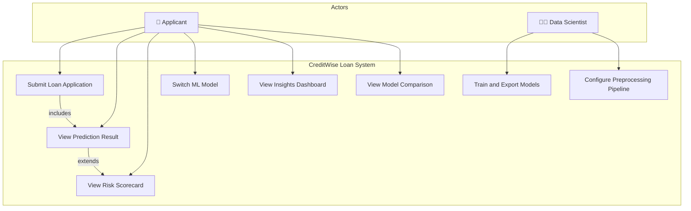

### 2. Class Diagram

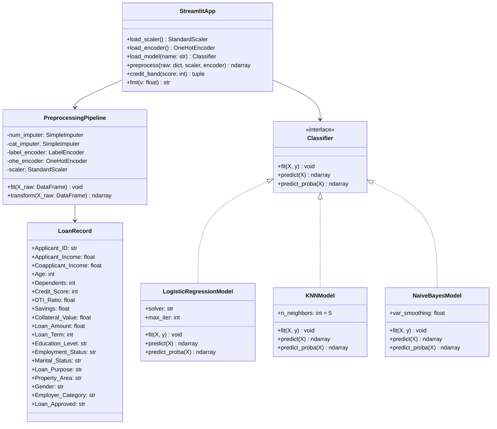

### 3. Sequence Diagram — Prediction Request

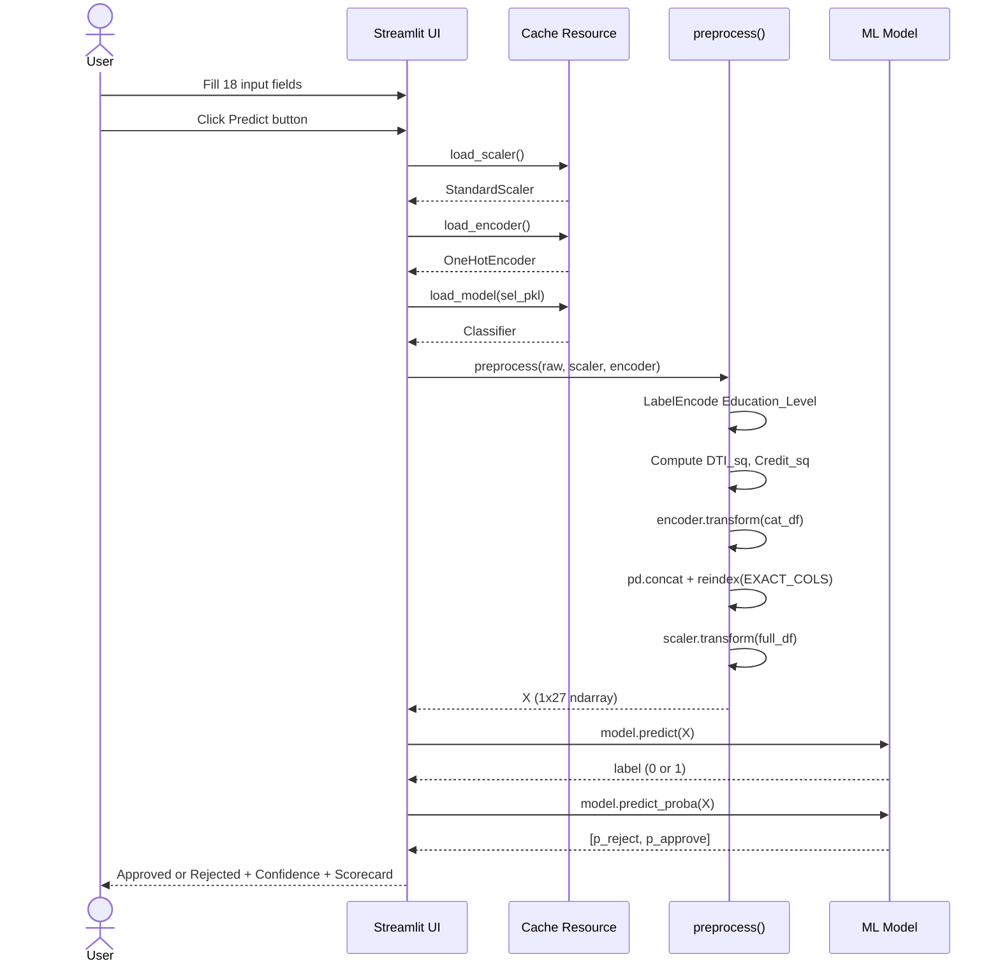

### 4. Activity Diagram — ML Training Pipeline

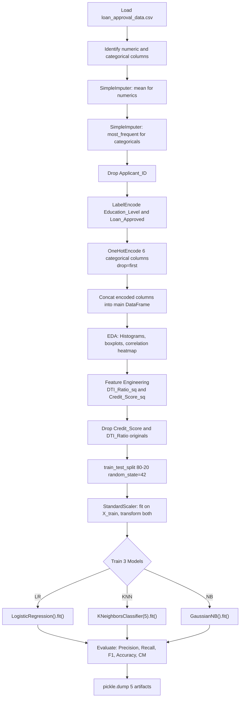

### 5. Component Diagram

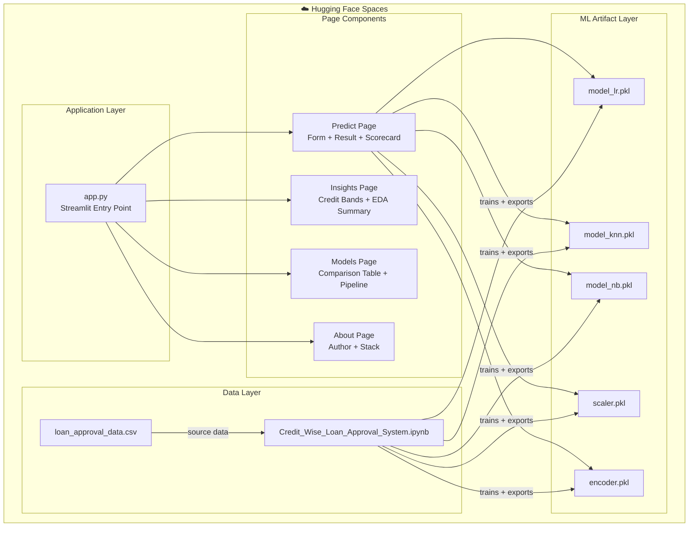

### 6. Deployment Diagram

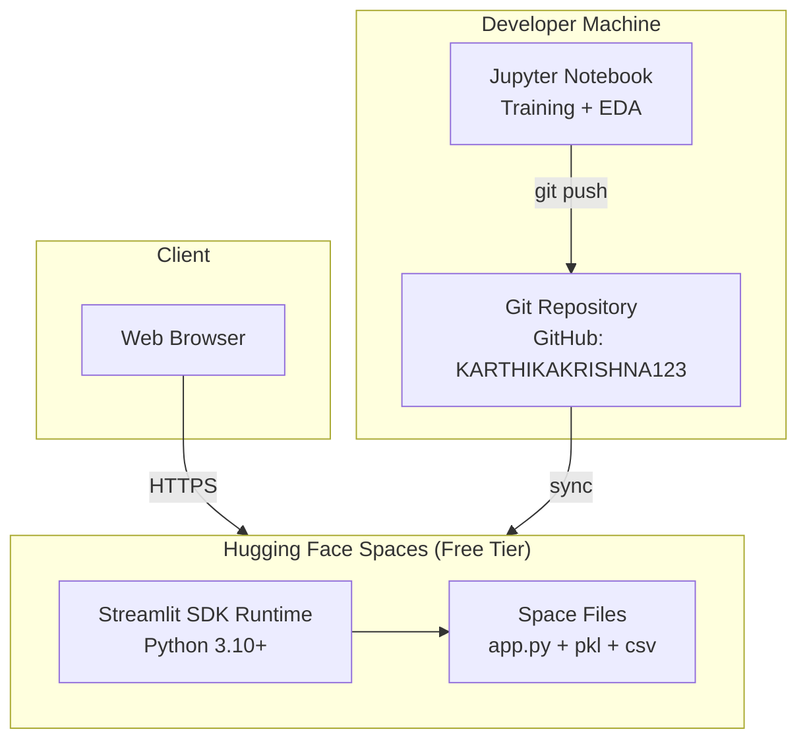

### 7. State Diagram — Prediction Lifecycle

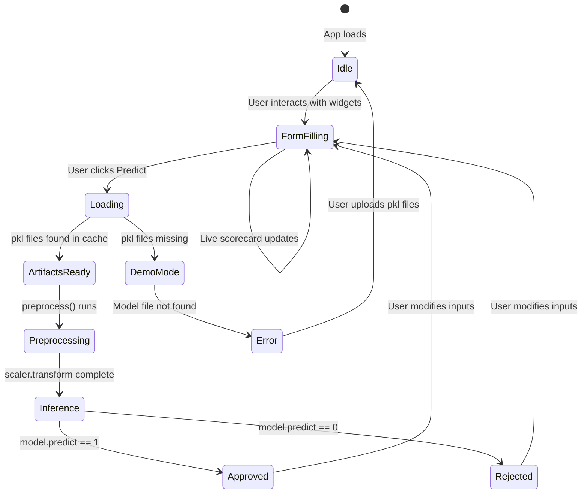

### 8. ER Diagram — Loan Record Schema

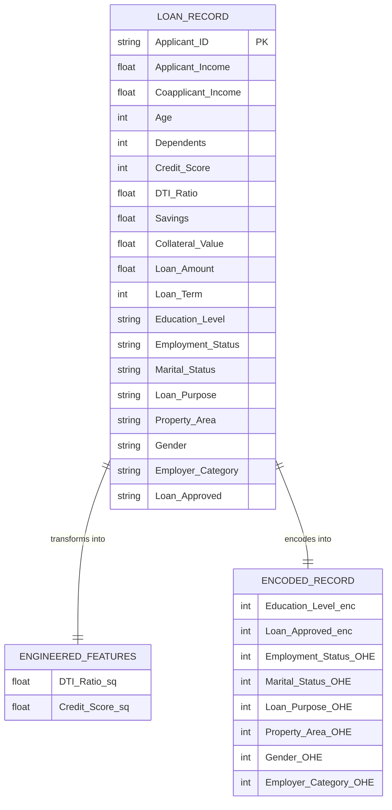

### 9. Package Diagram — Module Dependencies

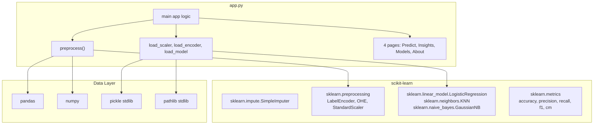

</details>

---

<details>
<summary>📊 Data Flow Diagrams (DFD Level 0 + Level 1)</summary>

### DFD Level 0 — Context Diagram

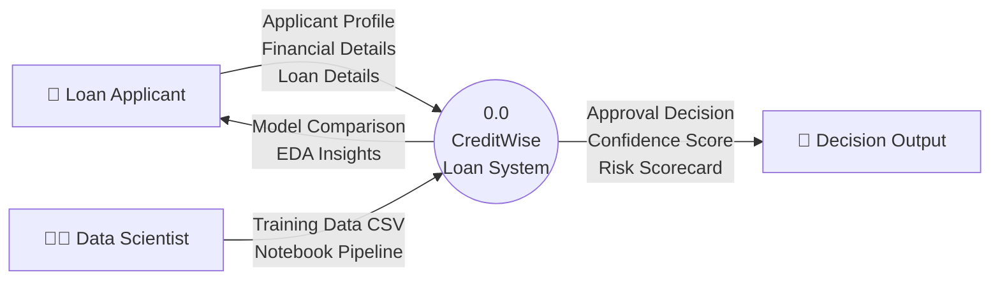

### DFD Level 1 — System Decomposition

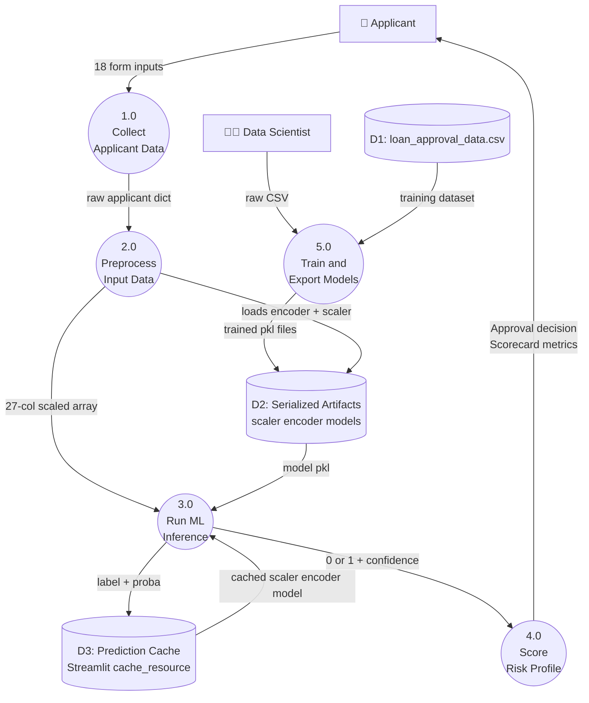

</details>

---

## 📁 Folder Structure

```
CreditWise_Loan_System/mine/
│
├── app.py                              ← Streamlit application entry point
│     ├── preprocess()                  ← Mirrors notebook pipeline exactly
│     ├── load_scaler/encoder/model()   ← @st.cache_resource loaders
│     ├── Pages: Predict, Insights, Models, About
│     └── Custom CSS: Navy-blue theme, pill badges, result cards
│
├── Credit_Wise_Loan_Approval_System.ipynb  ← Full ML training notebook (87 cells)
│     ├── Cells 0–16: Data loading + imputation
│     ├── Cells 17–40: EDA (distributions, boxplots, heatmap)
│     ├── Cells 41–65: Encoding + scaling pipeline
│     ├── Cells 69–77: Baseline model training + evaluation
│     ├── Cells 79–86: Feature engineering + retrain + pickle export
│     └── Cell 85: pickle.dump → 5 artifacts
│
├── loan_approval_data.csv              ← Source dataset (1,000 rows × 20 cols)
│
├── model_lr.pkl                        ← Trained LogisticRegression
├── model_knn.pkl                       ← Trained KNeighborsClassifier(n=5)
├── model_nb.pkl                        ← Trained GaussianNB (best precision)
├── scaler.pkl                          ← StandardScaler (fitted on 27-col X_train)
├── encoder.pkl                         ← OneHotEncoder(drop=first) for 6 cols
│
├── requirements.txt                    ← Python dependencies for HF Spaces
├── README.md                           ← HF Spaces metadata (YAML frontmatter)
├── CreditWise Loan System.pdf          ← Project report / documentation
└── .gitattributes                      ← Git LFS tracking for .pkl files
```

---

## ⚙️ ML Pipeline — Exact Notebook Recreation

The preprocessing pipeline in `preprocess()` is a deterministic reproduction of the notebook cells. Any deviation causes silent column-order mismatches → wrong predictions.

```
Notebook Cell → app.py Equivalent

Cell 12: SimpleImputer(mean) on numerics     → done at training time; inference uses form defaults
Cell 14: SimpleImputer(most_frequent) on cat → done at training time; inference uses form defaults
Cell 41: Drop Applicant_ID                   → never collected in the form
Cell 46: LabelEncode Education_Level         → manual mapping: Graduate=0, Not Graduate=1
Cell 46: LabelEncode Loan_Approved           → target only; not needed at inference
Cell 48: OneHotEncode 6 cols, drop=first     → encoder.transform(cat_df)
Cell 80: DTI_Ratio_sq = DTI_Ratio ** 2       → raw["DTI_Ratio"] ** 2
Cell 80: Credit_Score_sq = Credit_Score ** 2 → raw["Credit_Score"] ** 2
Cell 80: Drop Credit_Score, DTI_Ratio        → originals NOT included in num dict
Cell 65: StandardScaler                      → scaler.transform(full_df)
```

### Final 27-Column Feature Order (Critical)

```
Columns 0–9  (numeric):
  Applicant_Income, Coapplicant_Income, Age, Dependents,
  Existing_Loans, Savings, Collateral_Value, Loan_Amount,
  Loan_Term, Education_Level

Columns 10–24 (OHE — exact encoder.get_feature_names_out() order):
  Employment_Status_*, Marital_Status_*, Loan_Purpose_*,
  Property_Area_*, Gender_*, Employer_Category_*
  (15 cols after drop=first from 6 categorical columns)

Columns 25–26 (engineered):
  DTI_Ratio_sq, Credit_Score_sq
```

---

## 📊 Model Performance

| Model | Accuracy | Precision | Recall | F1 Score | Best Use Case |
|---|---|---|---|---|---|
| **Logistic Regression ⭐** | ~87.5% | ~79% | ~80% | ~80% | Default — balanced overall |
| K-Nearest Neighbours | ~75.5% | ~62% | ~56% | ~56% | Pattern-similarity matching |
| **Gaussian Naive Bayes** | ~86.5% | ~78% | ~78% | ~78% | Minimizing false approvals |

> ⚠️ *Dataset is class-imbalanced (~29.8% approved). F1 Score and Precision are primary metrics, not just Accuracy.*

---

## 🔒 Dataset — Feature Dictionary

| Feature | Type | Description | Impact on Approval |
|---|---|---|---|
| `Applicant_Income` | float | Monthly income of primary applicant (₹) | Higher → positive |
| `Coapplicant_Income` | float | Monthly income of co-applicant (₹) | Higher → positive |
| `Age` | int | Age of applicant | Mid-range preferred |
| `Dependents` | int | Number of financial dependents | More → negative |
| `Credit_Score` | int | CIBIL-style score (300–900) | **Strongest predictor** |
| `DTI_Ratio` | float | Debt-to-Income ratio (0.0–1.0) | Lower → positive |
| `Savings` | float | Current savings balance (₹) | Higher → positive |
| `Collateral_Value` | float | Asset value offered as security (₹) | Higher → positive |
| `Loan_Amount` | float | Requested loan amount (₹) | Lower relative to collateral → positive |
| `Loan_Term` | int | Repayment period in months | — |
| `Education_Level` | cat | Graduate / Not Graduate | Graduate → positive |
| `Employment_Status` | cat | Salaried / Self-employed / Contract / Unemployed | Salaried → best |
| `Marital_Status` | cat | Married / Single | — |
| `Loan_Purpose` | cat | Home / Car / Business / Education / Personal | — |
| `Property_Area` | cat | Urban / Semiurban / Rural | Urban → positive |
| `Gender` | cat | Male / Female | — |
| `Employer_Category` | cat | Government / MNC / Private / Business / Unemployed | Govt → best |

---

## 🛠️ Installation & Setup

### Prerequisites

```bash
Python 3.10+
pip
Git
```

### Local Setup

```bash
# 1. Clone repository
git clone https://github.com/KARTHIKAKRISHNA123/CreditWise_Loan_System.git
cd CreditWise_Loan_System

# 2. Create and activate virtual environment
python -m venv venv
source venv/bin/activate      # Linux/macOS
venv\Scripts\activate         # Windows

# 3. Install dependencies
pip install -r requirements.txt

# 4. Run the Streamlit app
streamlit run app.py
```

The app opens at `http://localhost:8501`

### Retrain Models from Scratch

```bash
# Open the notebook
jupyter notebook Credit_Wise_Loan_Approval_System.ipynb

# Run all cells sequentially (Cell 0 → 86)
# Cell 85 auto-exports all 5 pkl artifacts to the working directory
```

---

## 📦 Requirements

```
streamlit
pandas
numpy
scikit-learn
matplotlib
seaborn
```

> All pinned at latest stable at time of deployment. No version locking — HF Spaces resolves latest compatible set.

---

## 🚀 Deployment

### Hugging Face Spaces

The project is deployed as a Streamlit Space on Hugging Face. The `README.md` YAML frontmatter configures the Space:

```yaml
---
title: LendSure AI
emoji: 📊
colorFrom: blue
colorTo: indigo
sdk: streamlit
app_file: app.py
pinned: false
---
```

Push to the HF Space repository to trigger auto-deploy:

```bash
git remote add space https://huggingface.co/spaces/KarthikaKrishna123/CreditWise
git push space main
```

### Local Docker (optional)

```dockerfile
FROM python:3.10-slim
WORKDIR /app
COPY requirements.txt .
RUN pip install -r requirements.txt
COPY . .
EXPOSE 8501
CMD ["streamlit", "run", "app.py", "--server.port=8501", "--server.address=0.0.0.0"]
```

---

## 🔐 Security Considerations

| Risk | Mitigation |
|---|---|
| **Model file tampering** | `.gitattributes` enforces Git LFS tracking for `.pkl` files — binary integrity preserved |
| **Column order mismatch** | `reindex(EXACT_COLS)` with `fill_value=0` prevents silent wrong predictions on column mismatches |
| **Missing artifacts** | `Path.exists()` guards + warning banner in demo mode — no crash |
| **Input validation** | Streamlit widget constraints (`min_value`, `max_value`, `step`) prevent nonsensical inputs |
| **No PII storage** | All form inputs are ephemeral — no database, no logging, no user data persistence |

---

## ⚡ Performance

| Concern | Approach |
|---|---|
| **Model reload cost** | `@st.cache_resource` caches all pkl artifacts on first load — zero reload on re-predictions |
| **Preprocessing speed** | Pure NumPy/pandas operations — sub-millisecond for single record |
| **UI re-render** | Streamlit re-runs app top-to-bottom on each interaction — scorecard updates are lightweight arithmetic-only |
| **Memory** | Three models + scaler + encoder cached in memory — total ~5MB for all artifacts |


---

## 🐛 Troubleshooting

| Symptom | Cause | Fix |
|---|---|---|
| `⚠️ scaler.pkl not found` | pkl files not in working directory | Re-run Cell 85 in notebook; ensure artifacts are in same folder as app.py |
| `Prediction error: ...` | Column mismatch at inference | Retrain and re-export scaler with current feature engineering config |
| Streamlit runs but predictions always 0 | Scaler fitted on different feature set | Verify 27-column order matches `EXACT_COLS` list in `preprocess()` |
| HF Space fails to start | Dependency conflict | Pin versions in `requirements.txt`; check HF build logs |
| Wrong confidence values | Model doesn't support `predict_proba` | App defaults to 75.0% fallback — this is expected for some sklearn estimators |

---

## ❓ FAQ

**Q: Why are three separate models included?**  
A: To demonstrate the tradeoff between precision and recall — Naive Bayes minimizes false approvals (high precision), Logistic Regression balances both, KNN serves as a baseline for comparison.

**Q: Why squared transformations for DTI and Credit Score?**  
A: Credit score influence on approval is non-linear — a jump from 650→700 matters far more than 750→800. Squaring amplifies this signal without requiring tree-based models.

**Q: Why is `Applicant_Income_log` commented out?**  
A: Explored during EDA (Cell 80) but removed — income distribution wasn't sufficiently log-normal to warrant the transformation after imputation.

**Q: Why `reindex(EXACT_COLS)` instead of just concatenating?**  
A: `pd.concat` column order depends on DataFrame construction order, which can vary. `reindex` enforces deterministic column order matching `scaler.feature_names_in_`.

**Q: Is this suitable for production loan decisions?**  
A: No. This is an educational demonstration. Production systems require regulatory compliance (RBI guidelines), bias auditing, explainability standards (LIME/SHAP), and human-in-the-loop review.

---

## 📜 Contributing

1. Fork the repository
2. Create a feature branch: `git checkout -b feature/shap-explainability`
3. Make changes and test locally with `streamlit run app.py`
4. Ensure all pkl artifacts are reproducible from the notebook
5. Open a Pull Request with a description of changes

---

## 📄 License

MIT License — Free to use for educational and non-commercial purposes.

---

🤗 [KarthikaKrishna123 on Hugging Face](https://huggingface.co/KarthikaKrishna123)

*For educational and demonstration purposes only — not for real loan decisions.*

</div>
